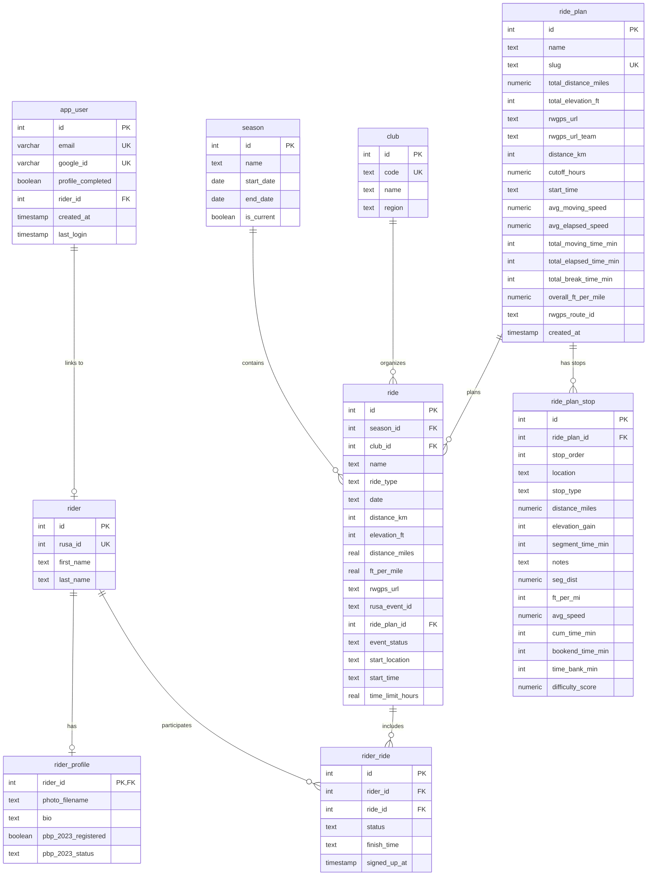

# Team Asha Randonneuring - Database Schema

## Entity Relationship Diagram



## Detailed Table Descriptions

### Authentication & User Management

#### `app_user`
Manages user authentication and links to rider profiles.

| Column | Type | Constraints | Description |
|--------|------|-------------|-------------|
| id | integer | PK, AUTO | Primary key |
| email | varchar(255) | NOT NULL, UNIQUE | User's email from Google OAuth |
| google_id | varchar(255) | NOT NULL, UNIQUE | Google OAuth identifier |
| profile_completed | boolean | DEFAULT false | Whether profile setup is complete |
| rider_id | integer | FK → rider(id) | Links to rider profile |
| created_at | timestamp | DEFAULT CURRENT_TIMESTAMP | Account creation time |
| last_login | timestamp | DEFAULT CURRENT_TIMESTAMP | Last login timestamp |

**Foreign Keys:**
- `rider_id` → `rider(id)`

---

### Rider Information

#### `rider`
Core rider information tied to RUSA membership.

| Column | Type | Constraints | Description |
|--------|------|-------------|-------------|
| id | integer | PK, AUTO | Primary key |
| rusa_id | integer | NOT NULL, UNIQUE | RUSA membership number |
| first_name | text | NOT NULL | Rider's first name |
| last_name | text | NOT NULL | Rider's last name |

#### `rider_profile`
Extended rider profile information.

| Column | Type | Constraints | Description |
|--------|------|-------------|-------------|
| rider_id | integer | PK, FK → rider(id) | Primary key and foreign key |
| photo_filename | text | NULL | Profile photo filename |
| bio | text | NULL | Rider biography |
| pbp_2023_registered | boolean | DEFAULT false | Paris-Brest-Paris 2023 registration |
| pbp_2023_status | text | NULL | PBP 2023 status |

**Foreign Keys:**
- `rider_id` → `rider(id)` (CASCADE on delete)

---

### Ride Planning & Management

#### `season`
Defines cycling seasons for organizing rides.

| Column | Type | Constraints | Description |
|--------|------|-------------|-------------|
| id | integer | PK, AUTO | Primary key |
| name | text | NOT NULL | Season name (e.g., "2025-2026") |
| start_date | date | NULL | Season start date |
| end_date | date | NULL | Season end date |
| is_current | boolean | DEFAULT false | Active season flag |

#### `club`
Cycling clubs/organizations hosting rides.

| Column | Type | Constraints | Description |
|--------|------|-------------|-------------|
| id | integer | PK, AUTO | Primary key |
| code | text | NOT NULL, UNIQUE | Short club code |
| name | text | NOT NULL | Full club name |
| region | text | NOT NULL | Geographic region |

#### `ride_plan`
Detailed ride route plans with timing and elevation data.

| Column | Type | Constraints | Description |
|--------|------|-------------|-------------|
| id | integer | PK, AUTO | Primary key |
| name | text | NOT NULL | Ride plan name |
| slug | text | NOT NULL, UNIQUE | URL-friendly identifier |
| total_distance_miles | numeric | NULL | Total distance in miles |
| total_elevation_ft | integer | NULL | Total elevation gain in feet |
| rwgps_url | text | NULL | RideWithGPS route URL |
| rwgps_url_team | text | NULL | Team-specific RWGPS URL |
| distance_km | integer | NULL | Total distance in kilometers |
| cutoff_hours | numeric | NULL | Time limit in hours |
| start_time | text | DEFAULT '07:00' | Default start time |
| avg_moving_speed | numeric | NULL | Average moving speed (mph) |
| avg_elapsed_speed | numeric | NULL | Average elapsed speed (mph) |
| total_moving_time_min | integer | NULL | Total moving time in minutes |
| total_elapsed_time_min | integer | NULL | Total elapsed time in minutes |
| total_break_time_min | integer | NULL | Total break time in minutes |
| overall_ft_per_mile | numeric | NULL | Average feet per mile |
| rwgps_route_id | text | NULL | RWGPS route identifier |
| created_at | timestamp | DEFAULT now() | Creation timestamp |

#### `ride_plan_stop`
Individual stops/waypoints along a ride plan.

| Column | Type | Constraints | Description |
|--------|------|-------------|-------------|
| id | integer | PK, AUTO | Primary key |
| ride_plan_id | integer | NOT NULL, FK → ride_plan(id) | Parent ride plan |
| stop_order | integer | NOT NULL | Sequential stop number |
| location | text | NOT NULL | Stop location name |
| stop_type | text | DEFAULT 'waypoint' | Type: waypoint/control/rest |
| distance_miles | numeric | NULL | Cumulative distance to stop |
| elevation_gain | integer | NULL | Elevation gain to this stop |
| segment_time_min | integer | NULL | Time for this segment |
| notes | text | NULL | Additional notes |
| seg_dist | numeric | NULL | Segment distance |
| ft_per_mi | integer | NULL | Feet per mile for segment |
| avg_speed | numeric | NULL | Average speed for segment |
| cum_time_min | integer | NULL | Cumulative time |
| bookend_time_min | integer | NULL | Time buffer |
| time_bank_min | integer | NULL | Time bank remaining |
| difficulty_score | numeric | NULL | Segment difficulty rating |

**Foreign Keys:**
- `ride_plan_id` → `ride_plan(id)` (CASCADE on delete)

#### `ride`
All ride events (Team Asha and external RUSA events).

| Column | Type | Constraints | Description |
|--------|------|-------------|-------------|
| id | integer | PK, AUTO | Primary key |
| season_id | integer | NOT NULL, FK → season(id) | Season this ride belongs to |
| club_id | integer | NOT NULL, FK → club(id) | Organizing club (TA=Team Asha, DBC/SFR/SCR/SRR=external) |
| name | text | NOT NULL | Ride/event name |
| ride_type | text | NULL | Type (brevet, populaire, PBP, etc.) |
| date | date | NOT NULL | Ride date (DATE type for proper date handling) |
| distance_km | integer | NOT NULL | Distance in kilometers |
| elevation_ft | integer | NULL | Total elevation gain |
| distance_miles | real | NULL | Distance in miles |
| ft_per_mile | real | NULL | Feet per mile ratio |
| rwgps_url | text | NULL | RideWithGPS URL |
| rusa_event_id | text | NULL | RUSA event identifier |
| ride_plan_id | integer | FK → ride_plan(id) | Associated ride plan (Team Asha rides) |
| event_status | text | DEFAULT 'UPCOMING' | Event status: UPCOMING/COMPLETED |
| start_location | text | NULL | Starting location/address |
| start_time | text | NULL | Event start time |
| time_limit_hours | real | NULL | Official time limit in hours |

**Foreign Keys:**
- `season_id` → `season(id)`
- `club_id` → `club(id)` (Required: use club_id to differentiate Team Asha vs external events)
- `ride_plan_id` → `ride_plan(id)`

**Note:** Team Asha rides have `club_id` pointing to 'TA' club. External events have `club_id` pointing to DBC, SFR, SCR, or SRR.

---

### Ride Participation

#### `rider_ride`
Tracks rider signups, participation and completion status (consolidated lifecycle).

| Column | Type | Constraints | Description |
|--------|------|-------------|-------------|
| id | integer | PK, AUTO | Primary key |
| rider_id | integer | NOT NULL, FK → rider(id) | Participating rider |
| ride_id | integer | NOT NULL, FK → ride(id) | The ride |
| status | text | NOT NULL | Status: SIGNED_UP/FINISHED/DNF/DNS |
| finish_time | text | NULL | Completion time (set when FINISHED) |
| signed_up_at | timestamp | NULL | Signup timestamp (NULL for historical rides) |

**Foreign Keys:**
- `rider_id` → `rider(id)` (CASCADE on delete)
- `ride_id` → `ride(id)` (CASCADE on delete)

**Lifecycle States:**
- `SIGNED_UP`: Rider registered, ride hasn't occurred yet
- `FINISHED`: Rider completed the ride successfully
- `DNF`: Did Not Finish
- `DNS`: Did Not Start

---

## Key Relationships

### User Authentication Flow
```
app_user → rider → rider_profile
```
- User logs in via Google OAuth (`app_user`)
- Links to RUSA rider profile (`rider`)
- Extended profile information (`rider_profile`)

### Ride Organization
```
season → ride ← club
         ↓
    ride_plan → ride_plan_stop
```
- Rides belong to seasons
- Rides organized by clubs
- Rides can reference detailed ride plans
- Ride plans contain multiple stops

### Ride Participation
```
rider → rider_ride → ride
```
- Complete lifecycle in `rider_ride`: signup → participation → result
- Status progression: SIGNED_UP → FINISHED/DNF/DNS

---

## Indexes & Constraints

### Unique Constraints
- `app_user.email` (UNIQUE)
- `app_user.google_id` (UNIQUE)
- `rider.rusa_id` (UNIQUE)
- `club.code` (UNIQUE)
- `ride_plan.slug` (UNIQUE)

### Referential Integrity
All foreign keys have proper CASCADE constraints on delete to maintain data integrity.

---

## Database Statistics

**Total Tables:** 9
**Total Foreign Key Relationships:** 9
**Authentication Tables:** 1
**Core Tables:** 5
**Junction Tables:** 1
**Reference Tables:** 2

---

*Generated on: 2026-02-24*  
*Last updated: 2026-02-24 - Consolidated rider_ride_signup into rider_ride; updated status values (yes→FINISHED, added SIGNED_UP); added signed_up_at timestamp*
